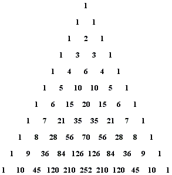

# Pascal's Triangle

In mathematics, Pascal's triangle is a triangular array of the binomial coefficients that arises in probability theory, combinatorics, and algebra. The binomial expression is  (x + y)^n, where n can be any positive integer and x, y are real numbers. It is named after the 17th century French mathematician Blaise Pascal (1623 - 1662).


The triangular array of numbers begins with 1 on the top and with 1's running down the two sides of a triangle. Each new number lies between two numbers and below them, and its value is the sum of the two numbers above it. /
This triangle is used in different types of probability conditions.

## Example with 11 rows



## About The Project

This project creates a function in python to generate Pascal's triangle with n rows.

## Getting Started

Let's start to use this project.

### Prerequisites

Python must be installed.

### Installation

To execute the project open the terminal and go to the project folder. Then execute it with python:

```sh
python3 pascals_triangle.py
```

You can Also use Jupyter Notebook to execute it in your browser or text editor directly.
